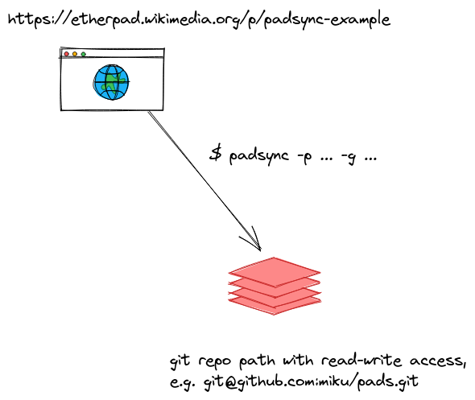

# Padsync

Tracking etherpads. Regularly take snapshots of a etherpad and store it in a git repository.



# Background

[The Carpentries](https://carpentries.org/) use etherpads during trainings,
which has some advantages:

* people can *edit collaboratively*, add and correct material during lessons
* people see others are active (m)
* when asked questions, you can see people writing (m)
* it is a snapshot of material covered in a lesson

There are some disadvantages as well:

* minimalistic format when using plaintext (maybe use hackmd, codimd)
* content might get lost
* limited notion of history

# Solution

Regularly export and commit content from etherpad into a git repository.
Multiple pads can be synced into a single repo.

You will need ssh (rw) access to a git repository.

By default, the content of
[https://yourpart.eu/p/example](https://yourpart.eu/p/example) will end up in
a file named `https-yourpart-eu-p-example.txt` (or pass in a path relative to
the repo root via -t).

```shell
$ padsync -dry -p https://yourpart.eu/p/example -g git@git.example.com:user/pads.git
2019/12/30 16:43:50 export URL at: https://yourpart.eu/p/example/export/txt
2019/12/30 16:43:50 fetched 11 bytes from https://yourpart.eu/p/example
2019/12/30 16:43:50 cache directory at /tmp/padsync-git-593767507
2019/12/30 16:43:50 git clone "git@git.example.com:user/pads.git" "/tmp/padsync-git-593767507"
2019/12/30 16:43:50 updating /tmp/padsync-git-593767507/https-yourpart-eu-p-example.txt
2019/12/30 16:43:50 cd "/tmp/padsync-git-593767507" && \
                    git add "/tmp/padsync-git-593767507/https-yourpart-eu-p-example.txt" && \
                    git commit -m "auto-commit" && \
                    git push origin master && \
                    cd -
2019/12/30 16:43:50 successfully updated repo
```

# Install

```
$ go get -u -v github.com/miku/padsync/cmd/padsync
```

# Credits

* Illustration from [etc.usf.edu/clipart/](https://etc.usf.edu/clipart/).
